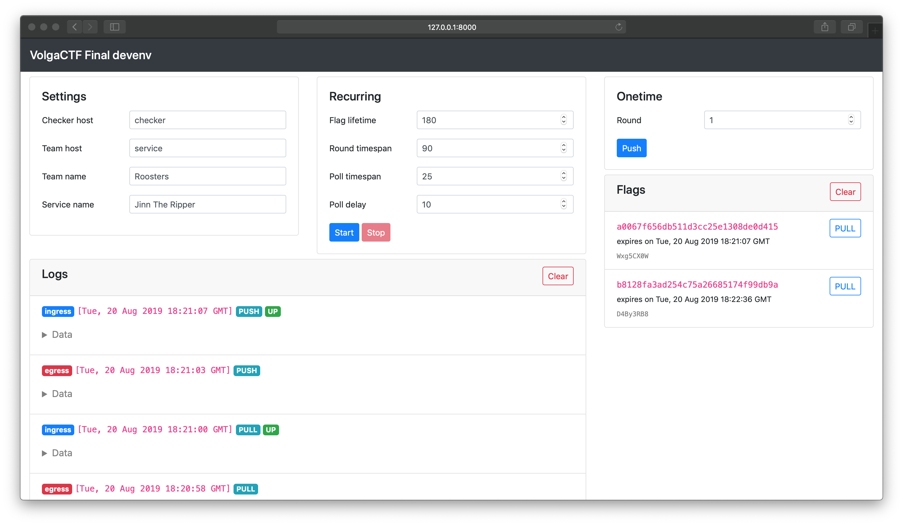

# VolgaCTF Final devenv

A platform to develop & test an A/D CTF service and its checker.

[VolgaCTF Final](https://github.com/VolgaCTF/volgactf-final) is an automatic checking system (ACS) for A/D CTF contests.

## Prerequisites
- *nix compatible system
- [Python 3](https://www.python.org/downloads/)
- [Docker Compose](https://docs.docker.com/compose/)

## A general outlook
This repository contains a docker-compose configuration for several containers, namely `redis`, `master`, `checker` and `service`, which provide a development and testing environment.

## Network
`master` must be able to communicate with `redis` and `checker` containers.

`checker` must be able to communicate with `master` and `service` containers.

## Setup
```
$ pip3 install ecdsa && python3 env_vars.py
$ cp docker-compose.example.yml docker-compose.yml
```

The commands above generate a few secrets (for flag signing) as well as create a `docker-compose.yml` file from a sample. This file may require further customization (see [Development](#development) section).

## Running
```
$ docker-compose up
```

Run containers in foreground (add `-d` flag to run in background). One may need to launch any `docker-compose` command as a superuser.

## Usage
Provided that everything is installed correctly, a dashboard is available on `http://127.0.0.1:8000`. 

The form at the top left helps specify common settings. Note that `Checker host` and `Team host` fields stand for a checker and a service container hostnames or IP addresses, so that other checkers and/or services may be used, regardless of whether they belong to the very docker-compose deployment or not.

The form at the top in the middle help specify `Recurring mode` settings:
- `Flag lifetime` stands for the number of seconds a flag is considered "live";
- `Round timespan` stands for an interval between subsequent `PUSH` operations (rounds);
- `Poll timespan` stands for an interval between subsequent `PULL` operations;
- `Poll delay` stands for the number of seconds before first `PULL` operation in a new round.

The form at the top on the right help specify `Onetime mode` settings. The only field here is `Round`.

The section on the right is populated with all pushed flags so that a `PULL` operation may be initiated. Note that `PULL` button is active only when an antecedent `PUSH` operation was successful.

Detailed logs comprise the section at the bottom.

### Advanced
The forms' default values can be customized in an `environment` section of the `master` container:

*docker-compose.yml*
```yaml
  ...
  master:
    image: 'volgactf/volgactf-final-devenv-master'
    environment:
      - DEFAULT_CHECKER_HOST=awesome-checker
      - DEFAULT_TEAM_HOST=awesome-service
      - DEFAULT_TEAM_NAME=Roosters
      - DEFAULT_SERVICE_NAME=Jinn The Ripper
      - DEFAULT_FLAG_LIFETIME=180
      - DEFAULT_ROUND_TIMESPAN=90
      - DEFAULT_POLL_TIMESPAN=25
      - DEFAULT_POLL_DELAY=10
      - LOG_HISTORY=50  # number of log entries to store
      - FLAG_HISTORY=10  # number of flags to store
  ...
```


## Development
To develop & test a service along with a checker, `service` and `checker` sections in `docker-compose.yml` should be modified accordingly:

*docker-compose.yml*
```yaml
  ...
  checker:
    # image: 'volgactf/volgactf-final-devenv-checker:1.0.0'
    image: 'awesome/awesome-checker:1.0.0'

  service:
    # image: 'volgactf/volgactf-final-devenv-service:1.0.0'
    image: 'awesome/awesome-service:1.0.0'
  ...
```

## See also

1. [master image source](https://github.com/VolgaCTF/volgactf-final-devenv-master)
2. [service image source](https://github.com/VolgaCTF/volgactf-final-devenv-service)
3. [checker image source](https://github.com/VolgaCTF/volgactf-final-devenv-checker)
4. [checker protocol](https://github.com/VolgaCTF/volgactf-final-checker-protocol)

## License
MIT @ [VolgaCTF](https://github.com/VolgaCTF)
